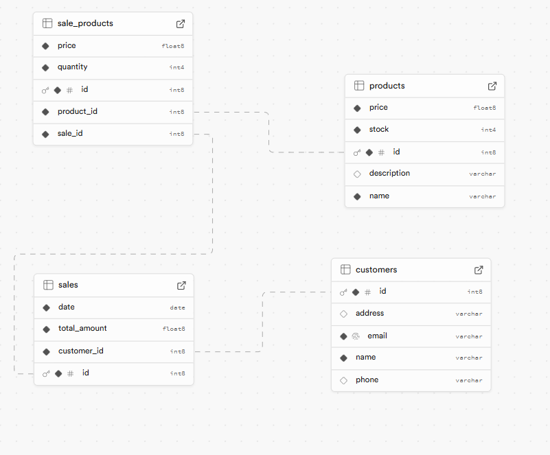

# Parcialspring
## Descripción
Parcialspring es una aplicación desarrollada con Spring Boot que gestiona ventas y clientes. Proporciona una API REST para realizar operaciones CRUD sobre las entidades de ventas y clientes.

## Requisitos
- Java 21
- Maven 3.8+
- PostgreSQL
## Entidad Reacion

## Presentado por
- [Andres Felipe Mateus Riaño](https://github.com/AndresMate/parcialspring)